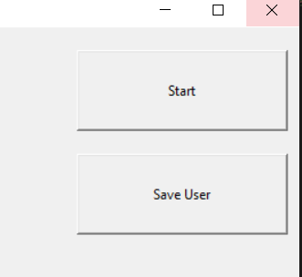
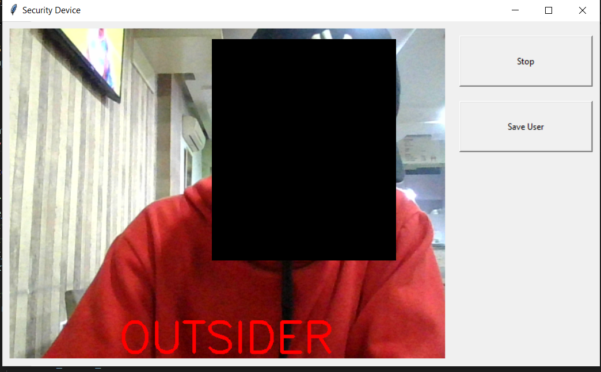

# UserGuard
 ## Overview

UserGuard is a **Real-Time Security System** that uses facial recognition to monitor and control access to a device. Built with Python, it integrates OpenCV, Tkinter, and DeepFace to detect and identify authorized users via the device's webcam. The system captures frames continuously, compares each frame with stored reference images of authorized users, and displays visual feedback on user status.


If an unauthorized user is detected, the system locks the screen and logs an image of the individual. Designed with simplicity and ease of use, the system includes a GUI where users can start or stop monitoring, as well as save new authorized user images.

Key features include:
- **Real-time face matching** with saved user images
- **Automatic screen lock** upon detection of an unauthorized user
- **Graphical User Interface (GUI)** for easy control
- **Multi-threaded processing** for responsive performance


## How to Use

1. **Install Dependencies**: Ensure you have Python installed, along with the required libraries. You need to install OpenCV, Tkinter, and DeepFace.

2. **Run the Script**:
   - Open a terminal in the directory where the script is saved.
   - Run the script with:

     ```bash
     python DeviceSecurity.py
     ```

   The DeepFace library will automatically download any necessary facial recognition models on first run.

3. **Using the Interface**:
   - **Save User**: Click the "Save User" button first. This action will take a photo of the user via the webcam and store it in the `user/` folder. This photo will serve as a reference image for the authorized user.
   - **Start**: Click the "Start" button to begin monitoring. The app will compare live video frames to the saved reference image(s) to detect authorized and unauthorized users.
   - If an unauthorized user is detected, the system will lock the screen and save a photo of the person in the `threat/` folder.
  



## Unauthorized User Detection

When the system detects an unauthorized user, it displays a red warning and labels the user as an "OUTSIDER" in the live video feed. In the example image below, the system has identified an unauthorized user, saved a photo of the user in the `threat/` folder, and **automatically locked the computer** to prevent access.




